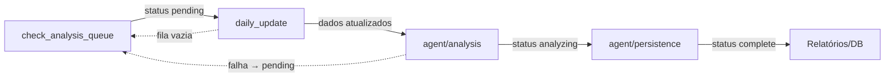

# Agente de Apostas com LangChain

Este módulo adiciona dois processos Node.js para gerar análises estruturadas de partidas e persistir os resultados em Markdown e no banco Postgres.

## Pré-requisitos
- Node.js 20+
- Postgres acessível com os esquemas `league_*`, `stats_match_details` e `team_lastx_stats` populados.
- Variáveis de ambiente configuradas (`.env`), em especial:
  - `OPENAI_API_KEY` (ou `openai_api_key`) para o modelo `gpt-5-nano`.
  - `PGHOST`, `PGPORT`, `PGDATABASE`, `PGUSER`, `PGPASSWORD` conforme o banco local.

Instale as dependências:

```bash
cd /Users/marcelomendes/Projetos/bets-estatistica
npm install
```

## Estrutura
- `agent/analysis/runAnalysis.js`: gera o JSON intermediário usando LangChain + ferramenta SQL.
- `agent/analysis/schema.js`: esquema Zod esperado do modelo.
- `agent/analysis/prompt.js`: prompt PT-BR base.
- `agent/persistence/generateMarkdown.js`: monta o texto final.
- `agent/persistence/saveOutputs.js`: escreve Markdown e insere em `game_analysis`/`suggested_bets`.
- `agent/persistence/reportUtils.js`: helpers de caminhos, leitura do JSON intermediário e validações.
- `agent/persistence/htmlRenderer.js`: converte o payload em HTML pronto para PDF.
- `agent/persistence/pdfGenerator.js`: usa Puppeteer para renderizar o HTML.
- `agent/persistence/reportService.js`: orquestra geração de HTML/PDF para um `match_id`.
- `agent/persistence/generateReport.js`: CLI para gerar relatório pontual.
- `agent/persistence/generateMissingReports.js`: CLI que percorre os intermediários e gera apenas os relatórios ausentes.
- `agent/persistence/main.js`: CLI do processo 2 (Markdown + banco).
- `data/analises_intermediarias/`: saídas JSON.
- `data/analises_finais/`: arquivos Markdown finais.
- `data/relatorios/`: contém `html/` e `pdf/` com os relatórios finais.

## Fila `match_analysis_queue`
- Tabela criada a partir de `sql/agent_schema.sql`, contendo apenas `match_id` e metadados (`status`, `last_checked_at`, `analysis_generated_at`, `error_reason`, timestamps).
- O job `node scripts/check_analysis_queue.js [--dry-run] [--window-hours=N]` garante que só os jogos que são o próximo compromisso **dos dois times** permaneçam na fila.  
  - `pending`: jogo precisa de atualização/análise.
  - `analyzing`: `runAnalysis` está em execução para aquele `match_id`.
  - `complete`: `agent/persistence` salvou a análise após o último jogo disputado.
  - `skipped`: reservado para exclusões manuais.
- Caso o jogo deixe de ser o próximo compromisso, o job remove a linha da fila; ela funciona como checklist vivo.

### Fluxo (alto nível)


## Pipeline diário
1. `node scripts/check_analysis_queue.js --window-hours 72` – recalcula a fila (`match_analysis_queue`) considerando apenas jogos que são o próximo compromisso para ambas as equipes e sem análise recente após o último jogo disputado.
2. `node scripts/daily_update.js` – consome a fila (status `pending`) para atualizar `stats_match_details` e `team_lastx_stats` apenas dos jogos necessários.
3. `node agent/analysis/runAnalysis.js today` – agora lê a fila; só executa se houver jogos `pending` e marca cada um como `analyzing` durante a execução.
4. `node agent/persistence/main.js <match_id>` – após gerar Markdown/JSON, marca o `match_id` como `complete` na fila, preenchendo `analysis_generated_at`.
5. `node agent/persistence/generateMissingReports.js` – cria HTML/PDF somente para os intermediários que ainda não possuem saída em `data/relatorios/html/` e `data/relatorios/pdf/`.

## Execução manual (exemplo com match_id 7834664)
```bash
node scripts/check_analysis_queue.js --dry-run
node scripts/daily_update.js
node agent/analysis/runAnalysis.js 7834664
node agent/persistence/main.js 7834664
node agent/persistence/generateMissingReports.js 7834664
node agent/analysis/runAnalysis.js today # executa para todos os jogos do dia atual que ainda estão 'incomplete'
```

Após o pipeline:
- `data/analises_intermediarias/<ano_mes_dia>_<time-casa>x<time-fora>.json`
- `data/analises_finais/<campeonato>_<home>vs<away>_<data>.md`
- `data/relatorios/html/<ano_mes_dia>_<campeonato>_<time-casa>x<time-fora>.html`
- `data/relatorios/pdf/<ano_mes_dia>_<campeonato>_<time-casa>x<time-fora>.pdf`
- Linhas em `game_analysis` e `suggested_bets`.

## Relatórios HTML/PDF
- `node agent/persistence/generateMissingReports.js [match_id]` lê `data/analises_intermediarias/`, ignora os que já possuem PDF correspondente e gera apenas os pendentes. Informe um `match_id` para limitar a execução a um único jogo.
- `node agent/persistence/generateReport.js <match_id>` continua disponível para regenerações manuais caso precise forçar um único relatório.
- Variáveis úteis:
  - `PUPPETEER_EXECUTABLE_PATH` (ou `CHROMIUM_PATH`) para apontar o binário do Chromium/Chrome existente.
  - `PUPPETEER_DISABLE_SANDBOX=true` caso rode em ambientes que exigem `--no-sandbox`.

## Dicas e resolução de problemas
- Caso o agente solicite SQL adicionais, os logs mostrarão `pg_select_reader`.
- Se o modelo não finalizar em até `AGENT_MAX_STEPS` (default 6), aumente `AGENT_MAX_STEPS` via ambiente.
- Ajuste `AGENT_TEMPERATURE`, `AGENT_MAX_TOKENS` e `AGENT_TIMEOUT_MS` conforme necessário.
- Certifique-se de executar `psql -f sql/agent_schema.sql` sempre que o schema for alterado.


